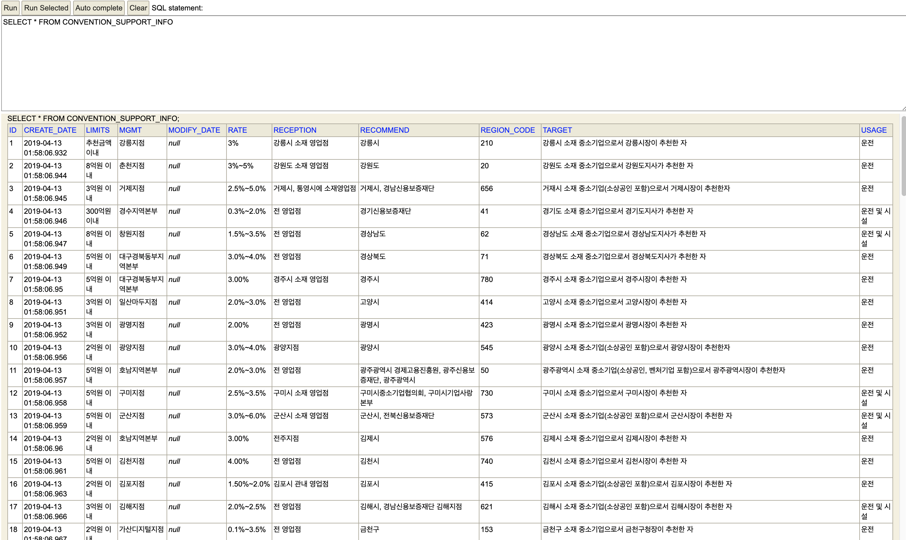

# ConventionSupportService

- Rest API로 Restful한 특징을 살려서 API를 구성함
- Swagger : http://localhost:8080/swagger-ui.html
- Database : http://localhost:8080/h2-console
~~~
JDBC URL: jdbc:h2:mem:testdb
User Name: sa
Password: <leave this empty>
~~~

## 프로젝트 기준선(BaseLine)

### Java & Framework baseline

- java 8 JDK
- spring boot 2.1.4.RELEASE

### Maven Dependency

- spring-boot-starter-web: Spring WEB(MVC모델로 개발)
- spring-boot-starter-validation: Validation 지원
- mybatis-spring-boot-starter: 마이바티스 지원
- lombok: 코딩 생산성 향상 지원
- spring-boot-starter-actuator: 프로덕션레벨의 모니터링 지원
- spring-boot-devtools: 개발 생산성 향상을 위한 라이브러리
- spring-boot-starter-aop: AOP 지원
- commons-lang3: apache Language 라이브러리
- httpclient: apache httclient 라이브러리
- commons-io: apache io 라이브러리
- joda-time: 시간관련 util 라이브러리
- junit-jupiter: junit 테스트를 위한 라이브러리
- opencsv: csv 파일 처리를 위한 라이브러리
- springfox-swagger2, springfox-swagger-ui: API 문서화(Swagger)
- h2: 데이터베이스
- hibernate: JPA 구현을 위한 ORM 프레임워크

### Swagger Preview

- 메인화면

- 파일업로드 API

### h2 Database Preview

- CONVENTION_SUPPORT_INFO 테이블

- REGION_INFO 테이블

### Validation Annotation 사용 시 주의사항

- @NotNull: 값이 null인지 또는 null이 아닌지 검사.
- @NotEmpty: 문자열나 배열의 경우 null이 아니고 길이가 0이 아닌지 검사한다. 콜렉션의 경우 null이 아니고 크기가 0이 아닌지 검사한다. (지원타입: CharSequence,Collection,Map,배열)
- @NotBlank: null이 아니고 최소한 한 개 이상의 공백아닌 문자를 포함하는지 검사한다. (지원타입: CharSequence)
- CharSequence: 문자열 관련 인터페이스로 이 인터페이스를 구현한 대표적인 클래스가 String이다.
